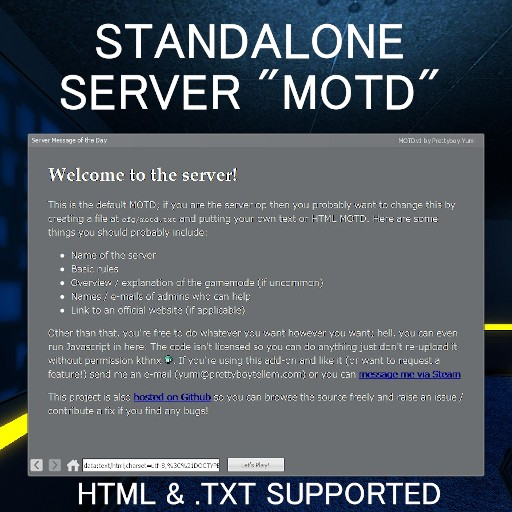

MOTD Support for Garry's Mod
============================

This add-on enables a custom "message of the day" to be displayed to users
upon connecting to the server. The MOTD should be an HTML or text file placed
in `cfg/motd.txt` up to one megabyte in size. Files over one megabyte are not
guaranteed to be rendered correctly by the client. This supports resolutions
down to 640x480 so expect it to work even if you're running GMod on your
toaster.

If you're handy with Lua, this add-on calls a custom client-side hook
`CloseMOTD` when the user clicks "Let's Play" and closes the MOTD panel; you
can take advantage of this to signal to the server to (e.g.) enlist the user
to a team or display some other information after joining the game.

Using MOTD
----------

Download this add-on from the Steam Workshop and write a MOTD (or copy one of
the thousand examples out there) and place it in `cfg/motd.txt`. You should
only really use this if you run a server; there are no dependencies for this
add-on and it is entirely self-contained, no need to write a website or host a
webpage just to display your MOTD.

Contributing / Source Code
--------------------------

All development of this add-on is done on [the Github page for this
project](https://github.com/yumi-xx/gmod-motd) so all issues / feature requests
should be submitted there by creating a new issue. Pull requests are respected
and are actually very helpful in developing / maintaining this project.
